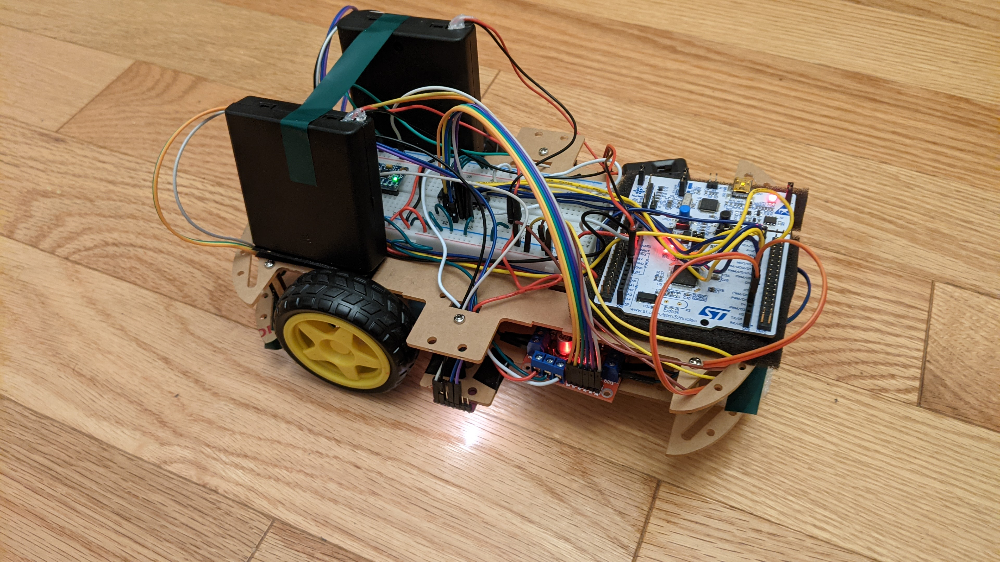
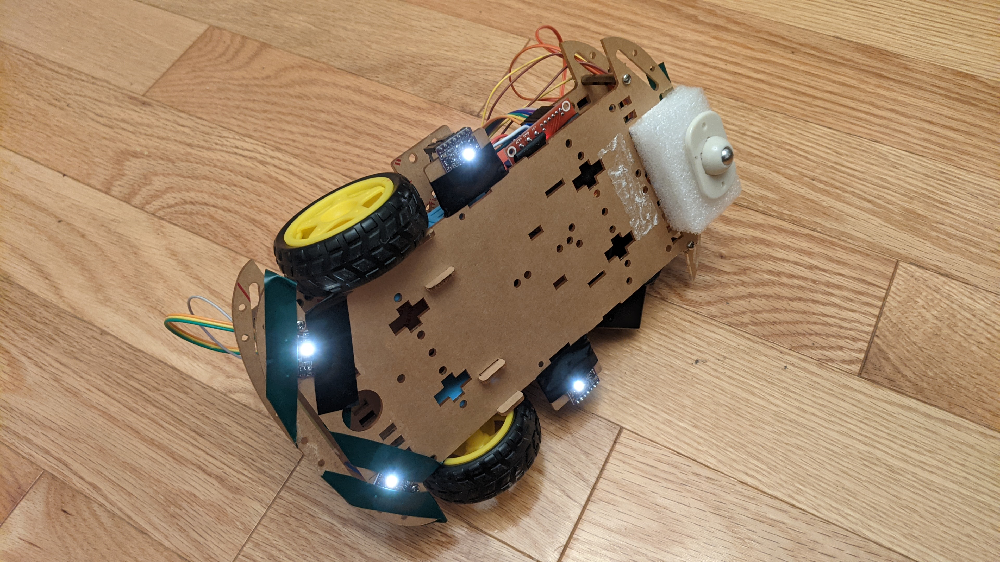
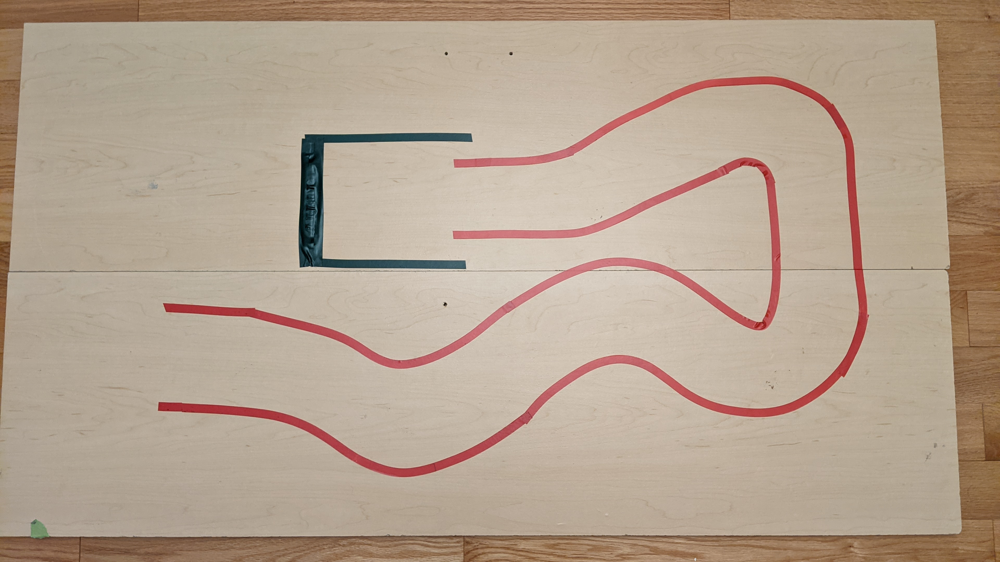

# STM32-LaneKeeper
A autonomous robotic vehicle with the purpose of lane keeping and eventually stopping in the "parking spot".
It uses 4 color sensors on the bottom of the vehicle and is currently programmed to stay between the 2 red lines (which acts as a lane), and stop at the dark green (which acts as a parking spot).

Programmed in `PlatformIO` using an `STM32`, a custom `PID` control loop for DC motors, and `I2C` communication protocol.

Some very short demos below (click on each one to visit the full video):

## Images
The STM32-LaneKeeper:

The underside of the robot:

The demo track I created for this project:

For more images, please see the [images folder](https://github.com/AshishA26/OmniBot/tree/master/Images) of this repo.

## Demos
2 different demos of the PID control loop in action attempting to match the speed of both wheels to the actual desired speed. The first is when the vehicle was placed on the ground, the second was while the vehicle was in the air.

## Schematics
- Coming soon!
